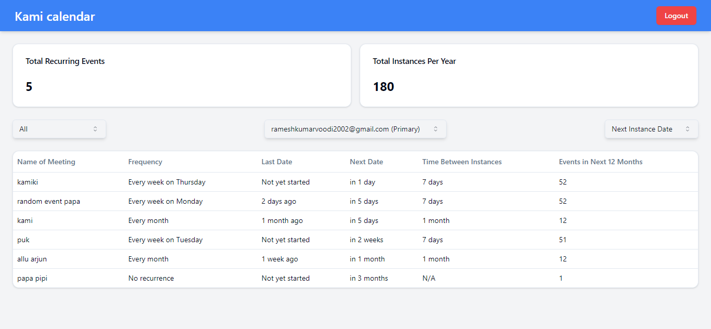

## About the project



this project is a simple calendar app that allows you to add events to your google calendar, it uses google calendar API to fetch and add events to your calendar.

## contributing

you can make a pull request to this repository, and we will review it as soon as possible.


## Technologies used

- React
- Typescript
- Tailwind CSS
- Node.js
- Express.js
- Google Calendar API
- shadcn-ui


# Running Locally 

To run this project locally, you need to follow these steps:

# Clone the repository

```bash
git clone this-repo-url
``` 


# setting up the Backend.

please head to [Google calendar Docs](https://developers.google.com/calendar/api/quickstart/js) to obtain `CLIENT_ID` and `CLIENT_SECRET`

# enable scopes in the google console

make sure to enable required scopes in the google console, you can find the scopes in the `server/src/index.ts` file

## edit the server/.env file

paste the `CLIENT_ID` and `CLIENT_SECRET` obtained from  [Google calendar Docs](https://developers.google.com/calendar/api/quickstart/js) in .env file

```bash
CLIENT_ID="YOUR_CLIENT_ID_HERE"
CLIENT_SECRET="YOUR_CLIENT_SECRET_HERE"
```

## start the server


head to `server` folder and run these commands in terminal: 

```bash
cd server

npm install
```

to run the using TS file directly, run this command:

```bash
npm run dev
```

to run the using JS file directly, run this command:

```bash
npm run build
npm run start
``` 

## Make sure to paste the `redirect url` in the google console `authorized redirect URIs`

* go to [Google console](https://console.cloud.google.com/apis/credentials?project) and paste the `redirect url` in the `authorized redirect URIs` 

* you can find the `redirect url` in the `.env` file in the server folder

```bash
  redirect url: backendurl/api/redirect
```

# setting Frontend:

head over to `client` folder and edit the Client/src/APP.tsx:

Edit the 'serverurl' , replace the url with your actual URL of Backend


to run the frontend, Run these commands: 

```bash
cd client

npm install

npm run start

```


# setting the URL'S 

after running the client, copy the `URL` of the frontend page and head to `server/.env` and paste the  `client url`

* Also make sure to copy your Backend URL and paste it in redirect url: 

```bash
CLIENT_ID="YOUR_CLIENT_ID_HERE"

CLIENT_SECRET="YOUR_CLIENT_SECRET_HERE"

# Redirect url

REDIRECT_URI= backendurl/api/redirect

# your frontend page url (example: localhost:3000)

CLIENT_URL="YOUR_CLIENT_URL"


```
